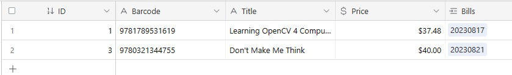
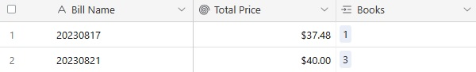

# Scan-Barcode-to-Airtable

A demo of scanning barcodes to Airtable.

[Online demo](https://tony-xlh.github.io/Scan-Barcode-to-Airtable/)

There are two tables in an Airtable base. One is for all scanned books and the other is for bills. The demo can create or open a bill and scan books by ISBN barcodes to add them in a bill. We can get the total price of the books of a bill.

Books table:

Bills table:

